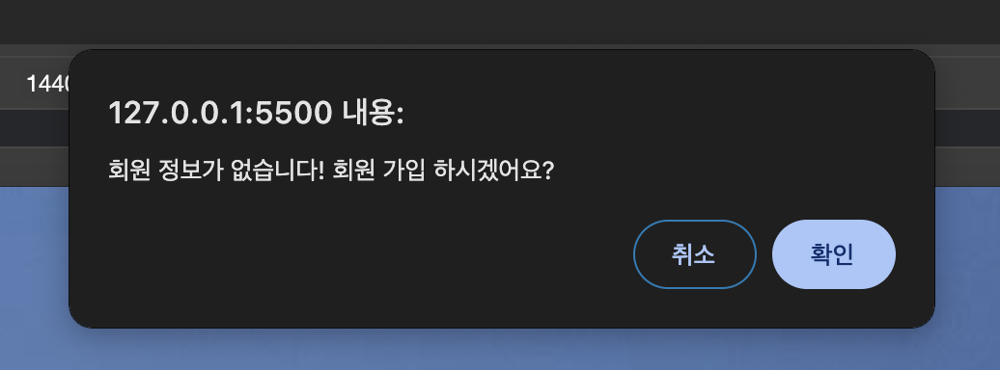
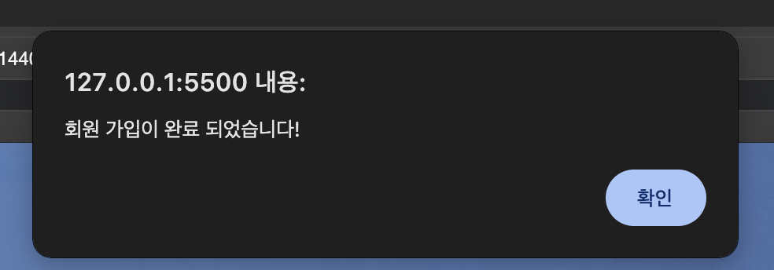
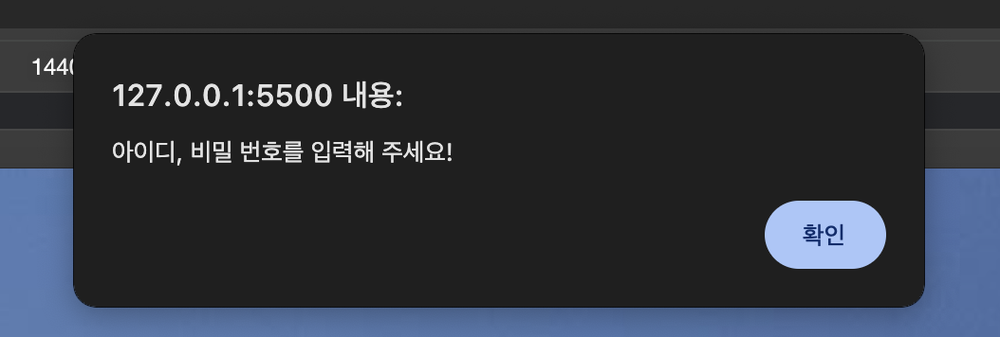
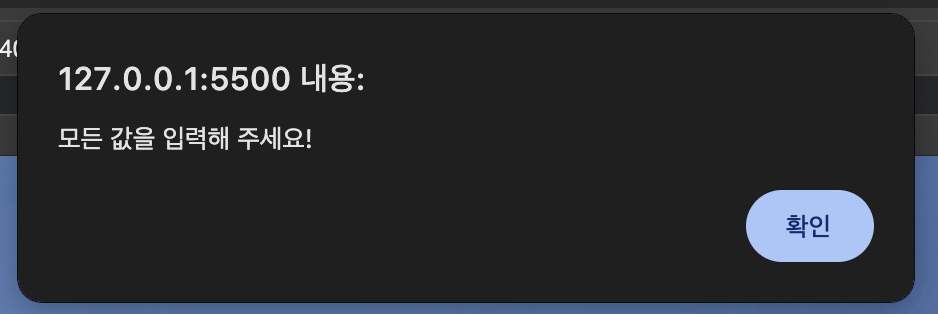
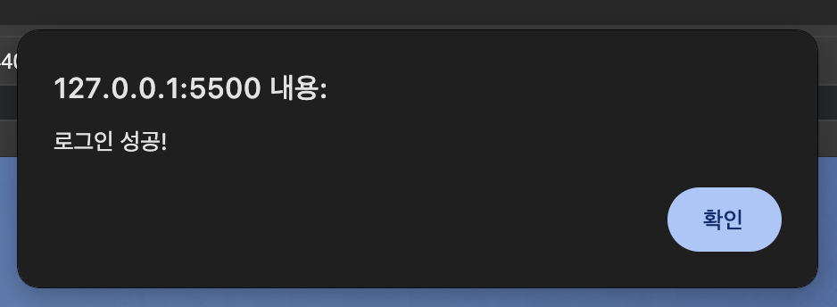
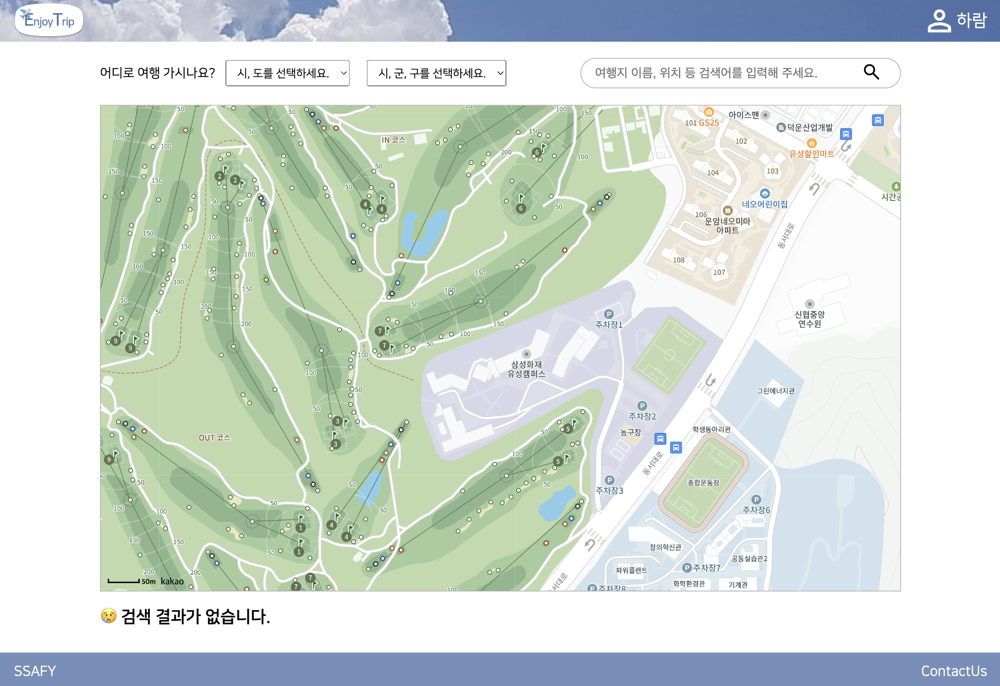
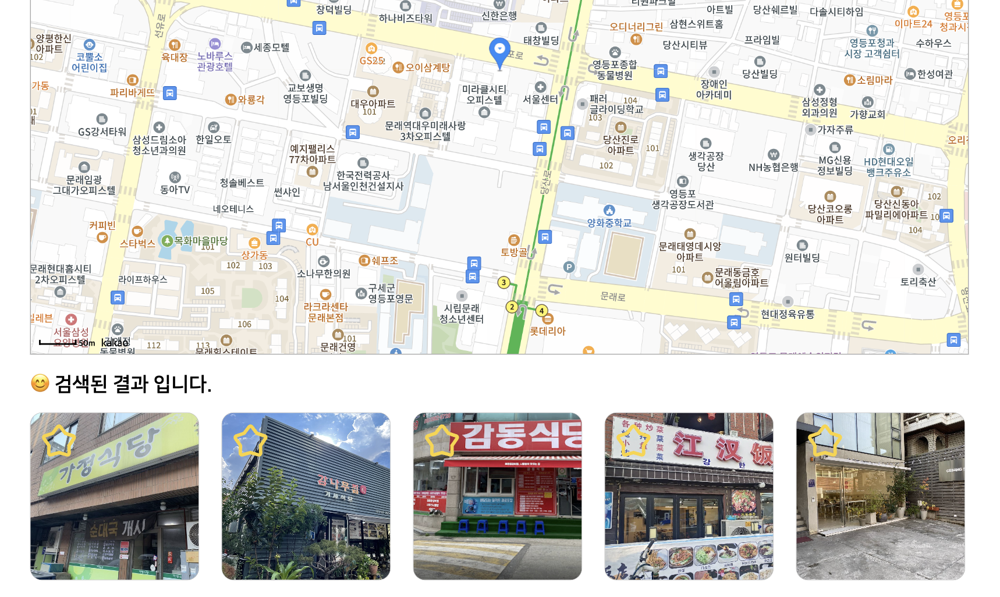
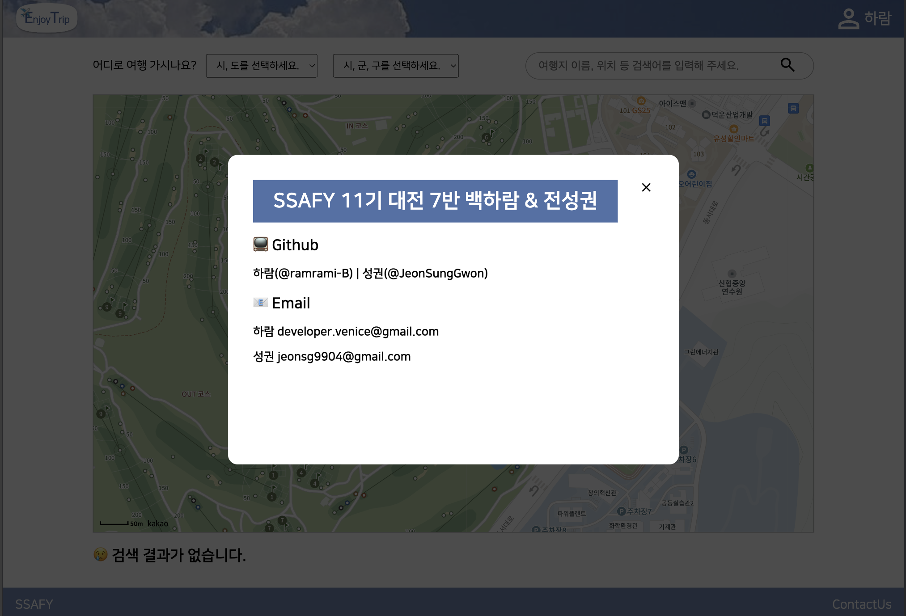

# [프론트 관통 10조] ✈️ Enjoy Trip!
바쁘고 지친 하루 하루, 아무런 걱정없이 여행을 떠나보세요.

# 🎄 폴더 구조
```
enjoytrip_frontend/
├── .git/
├── .vscode/
├── assets/
│  ├── css/
│  │  ├── index.css
│  │  ├── main.css
│  │  ├── mypage.css
│  │  └── sign.css
│  └── images/
│     ├── readme/
│     ├── back.svg
│     ├── background.png
│     ├── empty_star.svg
│     ├── full_star.svg
│     ├── logo.svg
│     ├── noimage.svg
│     ├── search.svg
│     ├── user.svg
│     └── user_white.svg
├── data/
│  ├── reviewData.js
│  └── tripData.js
├── src/
│  ├── js/
│  │  ├── component.js
│  │  ├── kakao.js
│  │  ├── main.js
│  │  ├── mypage.js
│  │  ├── service.js
│  │  └── sign.js
│  ├── pages/
│  │  ├── mainPage.html
│  │  ├── myPage.html
│  │  └── signPage.html
│  └── index.html
└── README.md

```

# 📺 화면 구성
1. 로그인 & 회원가입 
   - 로그인 또는 회원가입을 할 수 있는 페이지
    - 로그인을 시도 했을 때 가입되지 않은 회원이라면 회원가입 페이지로 이동
    - 회원 가입을 완료하면 자동으로 로그인 화면으로 전환 됨
    - 회원 가입 또는 로그인 페이지에서 입력하지 않은 값이 있다면 alert 창을 통해 모두 입력 하도록 함
    - 이전에 로그인 한 기록이 있다면 로그인을 하지 않고 메인페이지로 이동
2. 메인페이지
    - 지도를 기반으로 내가 검색한 여행지 정보를 알 수 있는 페이지
    - 지도의 가장 첫 좌표는 우리 대전 싸피 교육장 ㅎㅎ (삼성 화재 유성캠퍼스)
    - 지역, 키워드 기반 검색 가능, 지역은 대분류와 소분류가 있는데 대분류는 필수지만 소분류는 없어도 검색 가능(ex. 대구 - null - 카페 검색 가능)
    - 검색 결과는 지도의 좌표와 지도 아래 부분에 카드 형태로 뜨고, 카드를 클릭하면 해당 장소로 지도가 이동함 + 카드를 호버하면 여행지 제목과 장소를 미리 볼 수 있다!
    - 빈 별 아이콘을 누르면 꽉 찬 별로 변경되고, 지도에서도 즐겨찾기가 표시 됨
  
3. 마이페이지
   - 프로필을 관리하고 즐겨찾기 한 여행지를 볼 수 있어서 여행 계획을 세울 수 있는 페이지
   - 즐겨찾기 한 여행지가 뜸
   - 마이페이지에서 즐겨찾기를 해제할 수 있다
   - 프로필 사진을 변경할 수 있다 (=> 헤더에도 똑같이 적용됨)
   - 로그아웃, 회원 탈퇴 기능
4. 공통
   - 헤더를 통해 웹 사이트에서 이용할 수 있는 메뉴들을 표현
     - 헤더의 로고를 클릭하면 메인 페이지로 이동
     - 헤더의 프로필 부분을 클릭하면 마이 페이지로 이동
   - 푸터의 "SSAFY" 부분을 클릭하면 싸피 홈페이지가 새 창에 뜸
   - ContactUs를 클릭하면 개발자의 정보가 담긴 모달창이 뜸

<br />

# 🖥️ 화면 캡쳐
1. 로그인 & 회원가입 
   - 로그인 또는 회원가입을 할 수 있는 페이지


    - 로그인을 시도 했을 때 가입되지 않은 회원이라면 회원가입 페이지로 이동
  
  여기서 확인을 누르면 회원가입 화면이 뜸.
    - 회원 가입을 완료하면 자동으로 로그인 화면으로 전환 됨
    
    여기서 확인을 누르면 자동으로 로그인 화면이 뜸.
    - 회원 가입 또는 로그인 페이지에서 입력하지 않은 값이 있다면 alert 창을 통해 모두 입력 하도록 함
    
    로그인 할 때 아이디 또는 비밀 번호 둘 중 하나만 입력한 경우
    
    회원가입 할 때 어떤 값을 입력하지 않은 경우
    - 이전에 로그인 한 기록이 있다면 로그인을 하지 않고 메인페이지로 이동
    
    로그인 성공 시 로컬스토리지에 토큰이 저장 되어, 로그인 된 상태를 저장함

2. 메인페이지
    - 지도를 기반으로 내가 검색한 여행지 정보를 알 수 있는 페이지
        *지도의 가장 첫 좌표는 우리 대전 싸피 교육장 ㅎㅎ (삼성 화재 유성캠퍼스)
    
    - 지역, 키워드 기반 검색 가능, 지역은 대분류와 소분류가 있는데 대분류는 필수지만 소분류는 없어도 검색 가능(ex. 대구 - null - 카페 검색 가능)
    
    당연히 대분류 - 소분류 - 키워드 모두 있어도 검색할 수 있음!
    
    - 검색 결과는 지도의 좌표와 지도 아래 부분에 카드 형태로 뜨고, 카드를 클릭하면 해당 장소로 지도가 이동함
    
    
    
    +카드를 hover하면 여행지의 제목과 장소를 알려준다!
    - 빈 별 아이콘을 누르면 꽉 찬 별로 변경되고, 지도에서도 즐겨찾기가 표시 됨
    
    
    (취소도 가능)

3. 마이페이지
   - 프로필을 관리하고 즐겨찾기 한 여행지를 볼 수 있어서 여행 계획을 세울 수 있는 페이지
    
   - 즐겨찾기 한 여행지가 뜸
    
    내가 즐겨찾기 표시했던 여행지들 (똑같이 hover시 제목과 장소를 볼 수 있다.)
   - 마이페이지에서 즐겨찾기를 해제할 수 있다
    
    별 아이콘을 누르면 즐겨찾기가 해제되어 없어진다.
   - 프로필 사진을 변경할 수 있다 (헤더에도 똑같이 적용됨!) <br />
    
    
   - 로그아웃, 회원 탈퇴 기능
    
    로그아웃 되면 로그인 페이지로 자동으로 이동한다.
    
    회원탈퇴를 누르면 확인 창이 뜬다, 확인을 누르면 회원 탈퇴가 진행되고 로그인 페이지로 이동한다.
    
    같은 아이디로 로그인을 시도 했을 때, 회원 정보가 없다고 표시하는 것을 볼 수 있다! 


4. 공통
   - 헤더를 통해 웹 사이트에서 이용할 수 있는 메뉴들을 표현
     - 헤더의 로고를 클릭하면 메인 페이지로 이동
     - 헤더의 프로필 부분을 클릭하면 마이 페이지로 이동
   - 푸터의 "SSAFY" 부분을 클릭하면 싸피 홈페이지가 새 창에 뜸
   - ContactUs를 클릭하면 개발자의 정보가 담긴 모달창이 뜸
    
    많관부🤍

